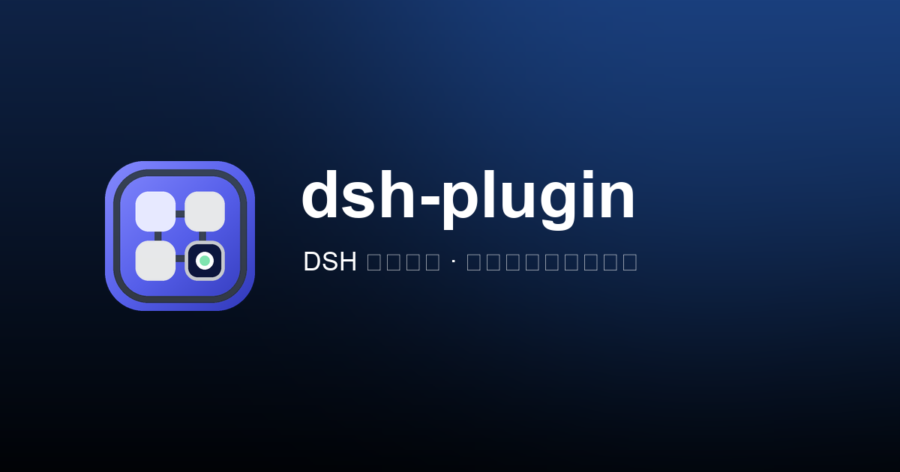

<p align="center">
  
</p>

<h1 align="center">DSH Plugin Hub</h1>

<p align="center">
  面向 DeepSeek Harness 社区的插件目录、安装证据索引与轻量安全筛查站。
  <br />
  Discover community plugins with real GitHub metadata, manifest evidence, and transparent risk signals.
</p>

<p align="center">
  <a href="https://dsh.lanshuagent.com/"></a>
  <a href="https://dsh.lanshuagent.com/api/registry/status"></a>
  <a href="https://github.com/cclank/dsh-plugin-hub/actions/workflows/ci.yml"></a>
  <a href="./LICENSE"></a>
  
  
  <a href="https://github.com/deepseek-ai/deepseek-harness"></a>
</p>

<p align="center">
  <a href="https://dsh.lanshuagent.com/">在线访问</a>
  ·
  <a href="https://dsh.lanshuagent.com/api/plugins">JSON API</a>
  ·
  <a href="https://dsh.lanshuagent.com/plugins.json">静态快照</a>
  ·
  <a href="https://github.com/topics/dsh-plugin">GitHub Topic</a>
</p>



## 项目简介

DeepSeek Harness 的插件生态增长很快，但仓库描述、安装命令和真实权限边界经常散落在不同位置。DSH Plugin Hub 将这些公开证据汇总成一个可搜索目录，帮助用户在安装前先确认：

- 项目是否真的声明了 `dsh.bundle`、`dsh.plugin`、`dsh.profile` 或 `dsh.client`；
- 安装命令是否绑定到完成静态检查的不可变 Git commit；
- 仓库是否活跃、是否有许可证和锁文件；
- 是否存在生命周期脚本、网络访问、文件写入、凭据读取或动态代码执行信号；
- 当前结果来自自动发现、社区精选，还是离线快照。

本站是独立社区项目，与 DeepSeek 官方没有隶属关系。

## 核心能力

| 能力 | 说明 |
| --- | --- |
| 真实插件数据 | 合并社区精选列表、GitHub `topic:dsh-plugin` 元数据和仓库根目录 manifest。 |
| 自动收录 | Cloudflare Cron 每 30 分钟发现新仓库，增量检查后写入 KV。 |
| 安装证据 | 只有在同一 Git commit 上完成 manifest 与入口源码检查后，才展示锁定 commit 的安装命令。 |
| 轻量筛查 | 检查许可证、锁文件、生命周期脚本和有限源码信号，并公开展示发现项。 |
| 插件浏览 | 支持搜索、分类、证据筛选、排序、卡片/列表视图和本地收藏。 |
| 双语与主题 | 支持中文、English、浅色和深色界面。 |
| 开放数据 | 提供动态 JSON API、运行状态接口和构建时静态快照。 |
| 访问热度 | D1 只保存真实根页面访问总数，页面按可配置倍率展示；历史基线和上线后计数独立保存。 |

## 数据链路

```text
awesome-dsh-plugin ─┐
                    ├─> 元数据归一化 ─> manifest / 源码信号检查 ─> 插件注册表
GitHub dsh-plugin ──┘                                          │
                                                               ├─> Web UI
Cloudflare Cron (30 min) ─> 增量复查 ─> Cloudflare KV ──────────┼─> JSON API
                                                               └─> 状态接口

Cloudflare 历史请求 ─> historical_root_views ─┐
                                               ├─> D1 真实总数 ─> × 展示倍率 ─> 访问热度
根页面实时请求 ─────> tracked_root_views ─────┘
```

数据源：

- [awesome-dsh-plugin](https://github.com/awesome-dsh-plugin/awesome-dsh-plugin)：社区精选列表；
- [GitHub `dsh-plugin` topic](https://github.com/topics/dsh-plugin)：自动发现入口；
- 各候选仓库的公开 README、`package.json`、manifest 声明、锁文件与有限源码文件；
- `data/curated.snapshot.json`：GitHub 暂时不可用时的离线回退。

### 筛查状态

| 状态 | 含义 |
| --- | --- |
| `clear` | 当前检查范围内未发现需要人工复核的信号。 |
| `review` / `pending` | 证据不足或发现了需要理解用途的权限/行为。 |
| `blocked` | 命中高风险信号，自动目录不会给出直接安装建议。 |

筛查结果只覆盖公开静态证据，不能替代完整代码审计、依赖审计或运行时沙箱验证。站点不会安装、构建或执行被收录插件。

## 公开 API

| 接口 | 用途 |
| --- | --- |
| [`GET /api/plugins`](https://dsh.lanshuagent.com/api/plugins) | 当前动态注册表，优先读取 Cloudflare KV。 |
| [`GET /api/registry/status`](https://dsh.lanshuagent.com/api/registry/status) | 最近同步时间、收录数量和筛查状态汇总。 |
| [`GET /api/visits`](https://dsh.lanshuagent.com/api/visits) | 真实访问、历史基线、展示倍率和访问热度。响应禁止缓存。 |
| [`GET /plugins.json`](https://dsh.lanshuagent.com/plugins.json) | 随构建发布的静态回退快照。 |

```bash
curl -sS https://dsh.lanshuagent.com/api/registry/status
```

`/api/plugins` 允许跨域读取，并带有短时公共缓存头，适合做社区机器人、插件推荐器或二次目录的数据源。

访问计数只记录成功返回的根页面 HTML 请求，不保存 IP、User-Agent、Cookie 或访客明细。D1 中的 `historical_root_views` 与 `tracked_root_views` 都是未放大的真实值；`VISIT_DISPLAY_MULTIPLIER` 只影响公开展示，因此以后将倍率改回 `1` 时，历史真实总数仍然完整。

## 本地开发

要求：

- Node.js `>=22.13.0`
- npm（使用仓库内的 `package-lock.json`）

```bash
git clone https://github.com/cclank/dsh-plugin-hub.git
cd dsh-plugin-hub
npm ci
npm run data:sync
npm run dev
```

默认开发环境使用打包快照。`data:sync` 会读取 GitHub 公共接口；匿名请求有限流，可选配置 Token：

```bash
GITHUB_TOKEN=github_pat_xxx npm run data:sync
```

Token 只需要读取公开仓库的权限，请勿提交到 Git。

## 常用命令

| 命令 | 作用 |
| --- | --- |
| `npm run dev` | 启动本地 vinext / Cloudflare Workers 开发环境。 |
| `npm run data:sync` | 只读同步精选列表、Topic 元数据和 manifest，更新本地快照。 |
| `npm run build` | 生成 Cloudflare Workers 与前端静态资源。 |
| `npm run lint` | 执行 ESLint。 |
| `npm run typecheck` | 执行 TypeScript 静态检查。 |
| `npm run types:generate` | 按构建后的 Wrangler 配置刷新 Worker binding 类型。 |
| `npm test` | 生产构建后执行筛查规则、SSR、API 和数据一致性测试。 |

## 部署到 Cloudflare

项目使用 vinext、Cloudflare Vite Plugin、Workers Cron、KV 和 D1。部署参数集中在 [`vite.config.ts`](./vite.config.ts)：

- Worker：`dsh-plugin-hub`
- KV binding：`PLUGIN_REGISTRY`
- D1 binding：`VISIT_METRICS`
- Cron：`*/30 * * * *`
- 默认自定义域名：`dsh.lanshuagent.com`

Fork 后请先替换自定义域名，并创建自己的 D1 数据库，将返回的 `database_id` 写入 `vite.config.ts`：

```bash
npm ci
npx wrangler d1 create dsh-plugin-hub-visits
npm run build
npx wrangler d1 migrations apply dsh-plugin-hub-visits --remote --config dist/server/wrangler.json
npx wrangler deploy --config dist/server/wrangler.json
```

首次启用计数时，可在 Cloudflare GraphQL Analytics 中按自定义域名、路径 `/`、`requestSource: eyeball` 查询切换时刻之前的根页面请求数，再将结果写入 `historical_root_views`。切换之后的新请求只增加 `tracked_root_views`，两段不会相互覆盖。

生产环境可选配置 GitHub Token，以提高 API 限额：

```bash
npx wrangler secret put GITHUB_TOKEN --config dist/server/wrangler.json
```

部署前可用 `npm test` 完成与 CI 相同的主要验证。

## 项目结构

```text
app/                       页面、交互和 Next 风格 API route
worker/                    Cloudflare Worker 入口与增量插件注册表
lib/                       数据类型和插件静态筛查逻辑
migrations/                D1 访问计数表迁移
scripts/sync-plugins.mjs   本地只读数据同步
data/                      精选回退与构建时注册表
public/plugins.json        对外静态快照
tests/                     筛查规则、SSR、API 与一致性测试
prototype/                 最初的设计原型，保留作视觉对照
```

## 参与贡献

欢迎提交以下类型的改进：

- 修正插件元数据、分类或安装证据；
- 补充可解释、低误报的筛查规则；
- 改善移动端、无障碍、双语文案和数据可视化；
- 为自动同步、API 和 Cloudflare 运行链路补测试。

提交 Pull Request 前请运行：

```bash
npm run lint
npm test
```

涉及筛查规则的改动，请同时增加最小正例和反例测试。请勿在 Issue、日志或测试夹具中提交真实 Token、私有仓库内容或用户配置。

## 安全与责任边界

- 自动检查不会运行第三方插件，也不会代表项目作者为插件背书；
- 安装命令绑定到已检查的 Git commit，仍不代表插件已经获得完整安全审计；
- README 声明与静态信号可能过期，安装前仍应查看目标仓库源码和发布记录；
- 发现本站漏洞时，请优先使用 GitHub Private Vulnerability Reporting，避免公开敏感复现细节。

## 致谢

- [DeepSeek Harness](https://github.com/deepseek-ai/deepseek-harness)
- [awesome-dsh-plugin](https://github.com/awesome-dsh-plugin/awesome-dsh-plugin)
- 所有公开插件、文档和安全边界的社区维护者

项目作者：[岚叔](https://github.com/cclank)

## 许可证

本项目采用 [MIT License](./LICENSE)。
